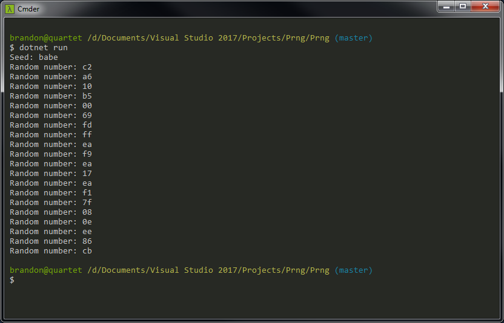
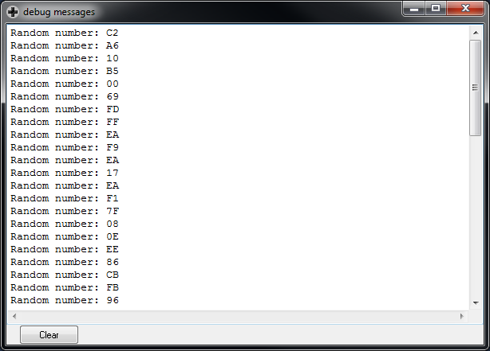
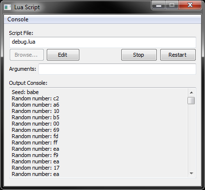

# PRNG
A C# implementation of the pseudorandom number generators here:
* Game Boy: https://github.com/taylus/gameboy-dev/tree/master/05-prng
* NES: https://github.com/taylus/nes-dev/tree/master/12-prng

There are no practical purposes for this code, unless maybe you're using some oddball .NET environment where System.Random doesn't exist. 🤷

I mostly put this together as an exercise in porting NES assembly, analyzing the distribution of the random numbers it generates, and checking that using
the same seed returns the same sequence of random numbers even across platforms. (It does! (I mean... of course it does.))

## C# output w/ fixed seed

## Game Boy output w/ fixed seed

## NES output w/ fixed seed

